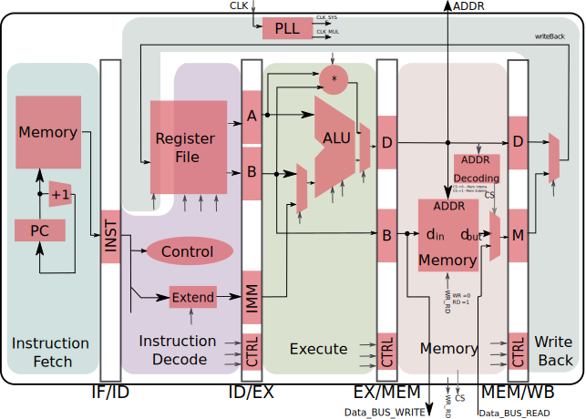

# MIPS

Trabalho final para a disciplina Projeto de Sistemas Digitais - ELTD05 da
Universidade Federal de Itajubá. Consiste na implementação de uma versão
simplificada de um processador MIPS.

## Arquitetura

## ISA

| Instruction name | Mnemonic | Format | 6 | 5  | 5  | 16     |
| ---------------- | -------- | ------ | - | -- | -- | ------ |
| Load Word        | LW       | I      | 3 | rs | rt | offset |
| Store Word       | SW       | I      | 4 | rs | rt | offset |

| Instruction name | Mnemonic | Format | 6 | 5  | 5  | 5  | 5  | 6  |
| ---------------- | -------- | ------ | - | -- | -- | -- | -- | -- |
| Add              | ADD      | R      | 2 | rs | rt | rd | 10 | 32 |
| Subtract         | SUB      | R      | 2 | rs | rt | rd | 10 | 34 |
| And              | AND      | R      | 2 | rs | rt | rd | 10 | 36 |
| Or               | OR       | R      | 2 | rs | rt | rd | 10 | 37 |

